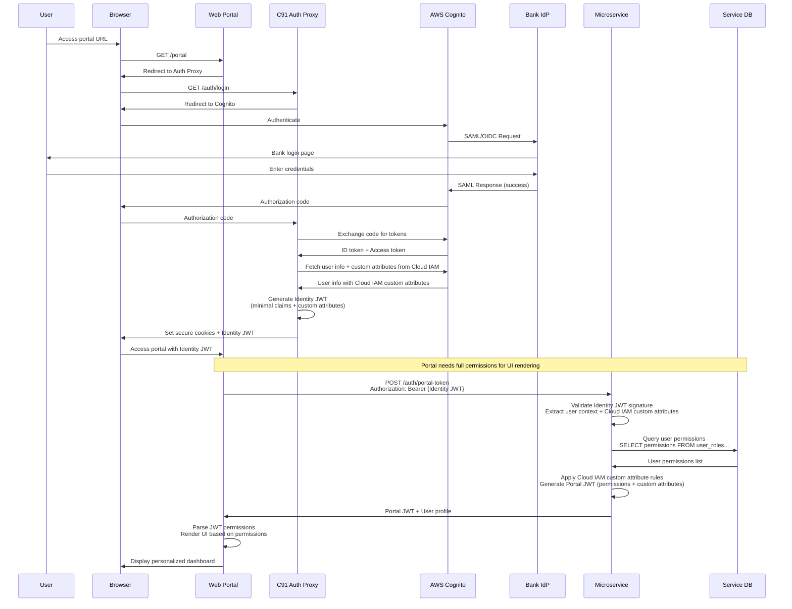
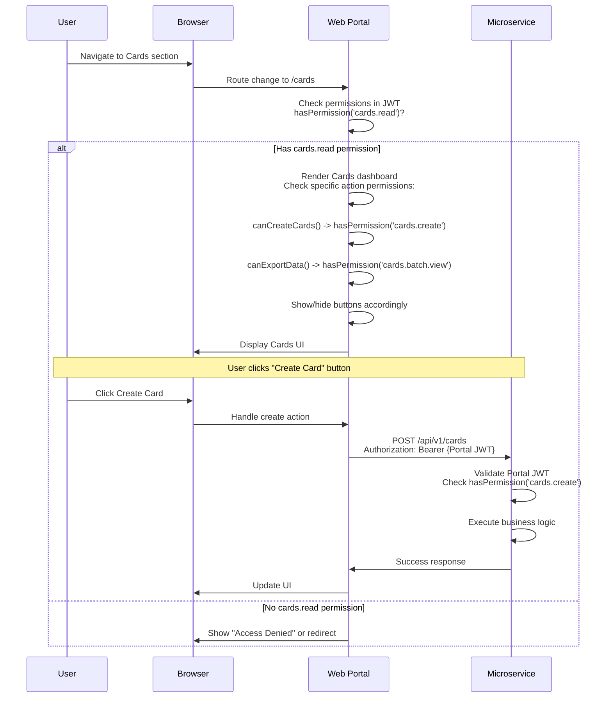
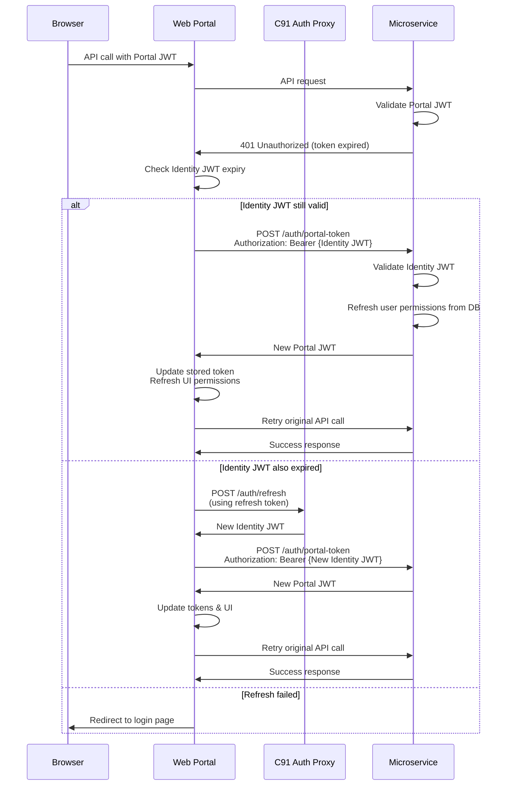
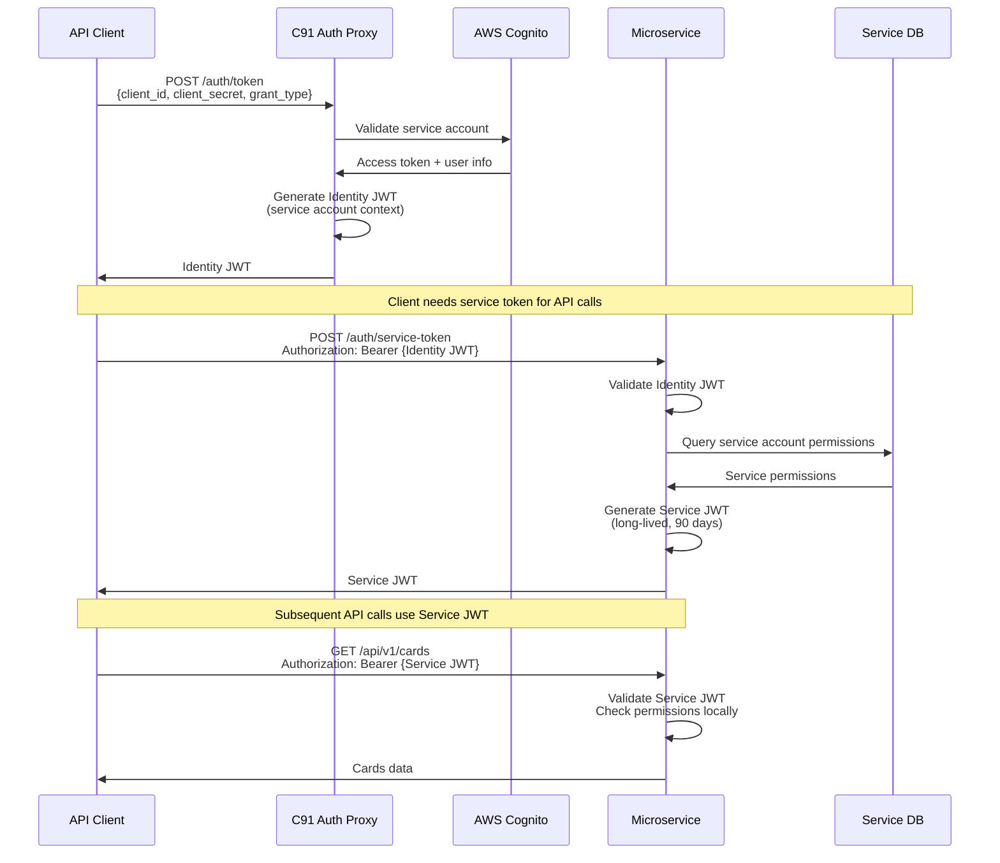
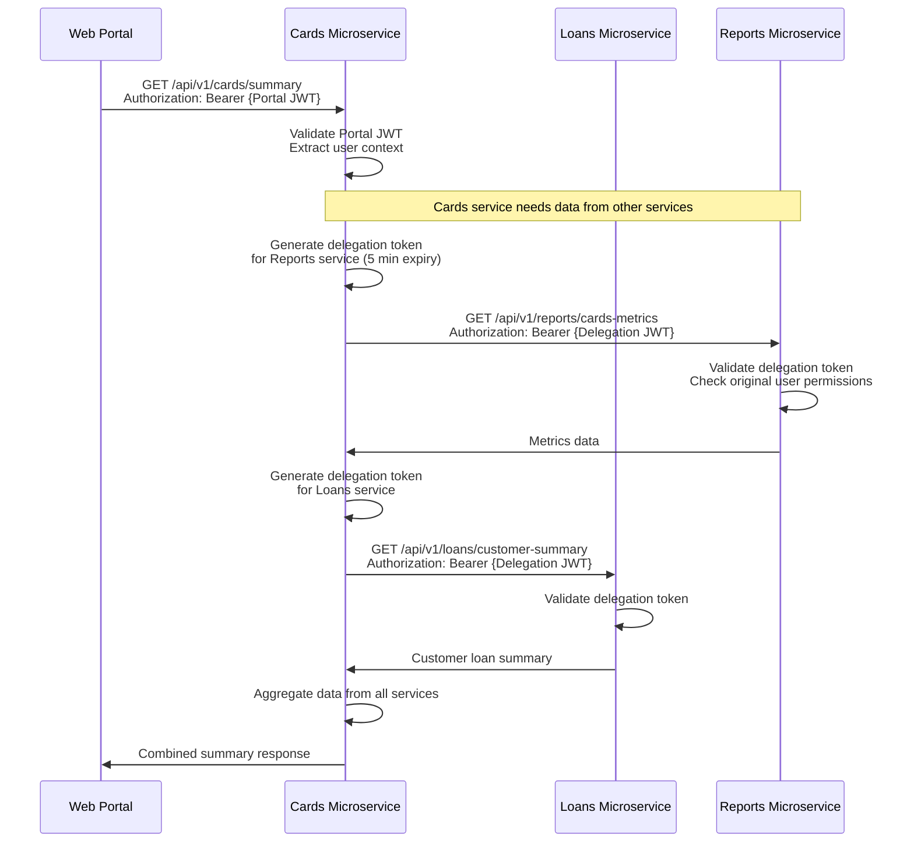
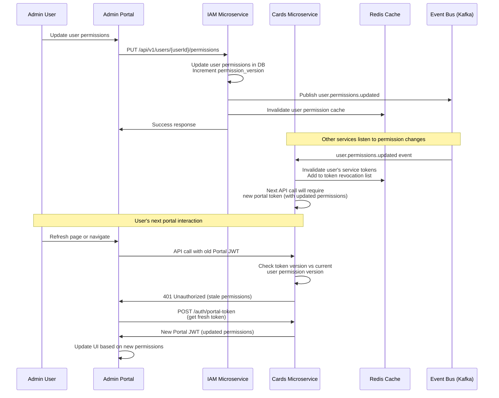

# Card91 Authentication Proxy - Sequence Diagrams

## Overview

This document contains detailed sequence diagrams for the Card91 Authentication Proxy (C91 Auth Proxy) using the **Option 1: Thin Authentication Service** approach with **simplified RBAC claims** where UI rendering logic is based on the same permissions used for API authorization. This architecture implements federated authentication through Cloud IAM services with custom attributes support.

## Key Architectural Principles

- **Single Source of Truth**: One permission system for both UI and API
- **Consistency**: What users see = what they can do
- **Two-Token System**: Identity JWT (from Auth Proxy) + Service/Portal JWT (from Microservice)
- **Business Logic Permissions**: Permissions named after business capabilities (e.g., `cards.read`, `cards.create`)
- **Federated Authentication**: Users authenticate with Bank/FI IdP, never with C91 directly
- **Custom Attributes Support**: Bank-defined attributes flow through tokens to microservices
- **Distributed Authorization**: Each microservice manages its own RBAC with custom attribute rules

---

## 1. Initial Web Portal Login Flow



**Key Points:**
- User authenticates through federated identity (Bank IdP → Cognito → Auth Proxy)
- Auth Proxy fetches custom attributes from Cloud IAM layer and includes them in Identity JWT
- Portal exchanges Identity JWT for Portal JWT containing full RBAC permissions + Cloud IAM custom attributes
- Microservices apply business rules based on Cloud IAM custom attributes (department, grade, branch, etc.)
- UI renders based on same permissions that control API access

---

## 2. Subsequent Portal Usage (Cached Permissions)



**Key Points:**
- UI navigation and element visibility based on JWT permissions
- Same permission check (`cards.create`) used for both button visibility and API call authorization
- No separate UI permission system - direct mapping from API permissions to UI elements

---

## 3. Token Refresh Flow



**Key Points:**
- Graceful token refresh without user intervention
- UI permissions automatically updated when new Portal JWT is issued
- Fallback to re-authentication if refresh fails

---

## 4. API Client Authentication Flow (Non-Portal)



**Key Points:**
- API clients follow same two-token pattern as portal
- Service accounts get long-lived Service JWTs for M2M communication
- Same permission validation logic for both portal and API clients

---

## 5. Cross-Service Communication Flow



**Key Points:**
- Services can delegate user context to other services using short-lived delegation tokens
- Original user permissions are preserved across service boundaries
- Enables secure cross-service communication while maintaining user context

---

## 6. Permission Changes Propagation



**Key Points:**
- Real-time permission changes propagated via event bus
- Token versioning prevents use of stale permissions
- UI automatically updates when permissions change

---

## Token Structures

### Identity JWT (from C91 Auth Proxy)
```json
{
  "sub": "user-123",
  "tenant": "hdfc",
  "email": "user@hdfcbank.com",
  "name": "John Doe",
  "external_id": "emp-456",
  "iss": "c91-auth",
  "aud": "c91-services",
  "exp": 1643724300,
  "token_type": "identity",
  "custom_attributes": {
    "department": "retail-banking",
    "branch_code": "BOM001",
    "employee_grade": "M3",
    "cost_center": "CC-1234",
    "reporting_manager": "manager-789",
    "authorized_products": ["cards", "loans"],
    "risk_level": "low"
  }
}
```

### Portal/Service JWT (from Microservice)
```json
{
  "sub": "user-123",
  "tenant": "hdfc",
  "email": "user@hdfcbank.com",
  "name": "John Doe",
  "iss": "cards-service",
  "aud": "cards-portal",
  "exp": 1643727900,
  "token_type": "portal_authorization",
  
  "permissions": [
    "cards.read",
    "cards.create", 
    "cards.update",
    "cards.batch.view",
    "reports.cards.view"
  ],
  
  "roles": ["CARD_OPERATOR"],
  
  "context": {
    "branch_codes": ["BOM001", "BOM002"],
    "product_access": ["credit", "debit"],
    "max_transaction_limit": 100000
  },
  
  "custom_attributes": {
    "department": "retail-banking",
    "branch_code": "BOM001",
    "employee_grade": "M3",
    "cost_center": "CC-1234",
    "reporting_manager": "manager-789",
    "authorized_products": ["cards", "loans"],
    "risk_level": "low"
  },
  
  "permission_version": 5
}
```

## Permission Naming Convention

```yaml
Permission Structure: {resource}.{action}

Examples:
  cards.read          # Can view cards
  cards.create        # Can create new cards  
  cards.update        # Can modify existing cards
  cards.delete        # Can delete cards
  cards.batch.view    # Can export/view batch operations
  
  reports.cards.view  # Can view card reports
  reports.cards.export # Can export reports
  
  admin.users.read    # Can view user management
  admin.users.create  # Can create users
  admin.roles.manage  # Can manage roles and permissions
```

---

## Custom Attributes Usage Examples

The C91 Auth Proxy architecture enables rich business logic through custom attributes **defined and managed entirely in the Cloud IAM layer** (AWS Cognito/Azure AD B2C), **not in C91 systems**:

### Common Custom Attributes (Defined in Cloud IAM)
- `department`: "retail-banking", "corporate-banking", "treasury" *(Cloud IAM: custom:department)*
- `branch_code`: "BOM001", "DEL002", "CHN003" *(Cloud IAM: custom:branch_code)*
- `employee_grade`: "M1", "M2", "M3", "M4" (Manager levels) *(Cloud IAM: custom:employee_grade)*
- `cost_center`: "CC-1234", "CC-5678" *(Cloud IAM: custom:cost_center)*
- `reporting_manager`: "manager-789" *(Cloud IAM: custom:reporting_manager)*
- `authorized_products`: ["cards", "loans", "deposits"] *(Cloud IAM: custom:authorized_products)*
- `risk_level`: "low", "medium", "high" *(Cloud IAM: custom:risk_level)*

**Note**: All these attributes are stored and managed in the Cloud IAM layer, not in C91 databases.

### Business Rules Examples
- **Branch-based Access**: Users can only see data for their assigned branch
- **Grade-based Permissions**: M3+ managers get batch approval rights
- **Product Authorization**: Users can only access products they're authorized for
- **Risk-based Restrictions**: High-risk users can't perform bulk operations
- **Department Routing**: Different workflows for retail vs corporate banking

---

## Summary

These sequence diagrams illustrate a clean, decoupled authentication architecture where:

1. **Authentication is centralized** through C91 Auth Proxy and cloud IAM services
2. **Authorization is distributed** with each microservice managing its own RBAC
3. **UI and API permissions are unified** - same permission strings control both visibility and access
4. **Token lifecycle is managed** through a two-token system providing both identity and authorization
5. **Cross-service communication** is enabled through delegation tokens
6. **Permission changes propagate** in real-time through event-driven architecture
7. **Custom attributes enable** sophisticated business rules and fine-grained access control
8. **Federated authentication** ensures users authenticate only with their bank/FI, never with C91

This approach provides the flexibility and autonomy that existing microservices need while maintaining security, consistency, and a great user experience. The custom attributes support enables banks to implement their own business rules without code changes in the C91 platform.